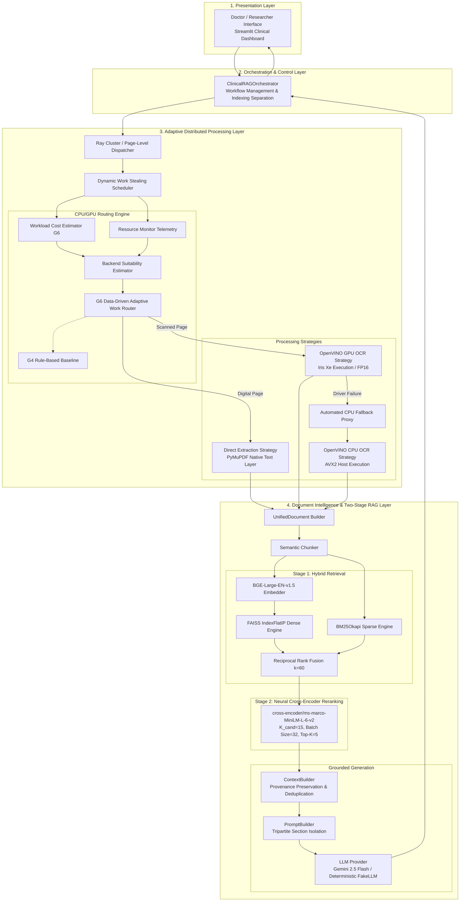

# Final System Architecture: Adaptive Distributed Parallel Processing Framework for Large-Scale Biomedical Document Intelligence

## 1. Project Objective

The primary objective of this framework is to provide a robust, high-throughput, and scientifically grounded architecture for large-scale biomedical document intelligence and clinical decision support. 

Biomedical corpora present severe processing bottlenecks: high-resolution rasterised scans, multi-page medical records, heterogeneous digital layouts, dense clinical jargon, and stringent evidence grounding requirements. This framework unifies distributed page-level workload scheduling, intelligent CPU/GPU hardware offloading, and a two-stage hybrid retrieval-augmented generation (RAG) pipeline into an end-to-end clinical intelligence system.

The system is strictly framed as a **clinical decision-support prototype** designed to assist qualified clinicians in navigating dense clinical records. It is **not** an autonomous diagnostic or prescription system.

---

## 2. Overall System Architecture

The architecture enforces strict decoupling between infrastructure, parallel scheduling, document extraction, vector retrieval, reranking, and clinical presentation.



---

## 3. Distributed Processing Layer

- **Framework**: Ray Distributed Parallel Processing Engine.
- **Granularity**: Page-level work decomposition (`PageWorkUnit`). Rather than dispatching monolithic multi-page documents to individual nodes, documents are decomposed into individual page tasks.
- **Load Balancing**: Priority task queues ordered by compute intensity and page complexity.
- **Work Stealing**: Dynamic runtime work stealing enabled when worker queue variance exceeds threshold ($\sigma > 2.0$), preventing straggler bottlenecks on dense pathology reports.
- **Fault Recovery**: Automatic retry of failed page tasks up to 3 times before graceful degradation.

---

## 4. Adaptive Scheduling Layer

The CPU/GPU routing hierarchy maintains a clear distinction between the historical baseline and the final data-driven routing model:

```text
CPU/GPU Work Routing
     |
     +--> G4 Rule-Based Baseline (Static Complexity Thresholds)
     |
     +--> G6 Data-Driven Adaptive Router [FINAL RESEARCH POLICY]
```

### G6 Data-Driven Routing Components
1. **WorkloadCostEstimator**: Extracts pre-OCR physical features in $<0.07$ ms:
   - Total resolution / pixels ($N_{\text{pixels}}$)
   - Dark pixel density ($N_{\text{density}}$)
   - Laplacian variance / edge texture complexity ($N_{\text{complexity}}$)
   - Estimated character density ($N_{\text{chars}}$)
   - Computes compute intensity: $C \in [0.0, 1.0]$.
2. **BackendSuitabilityEstimator**: Calculates calibrated suitability scores $S_{\text{CPU}}$ and $S_{\text{GPU}}$ considering:
   - Workload intensity $C$
   - Real-time CPU and GPU utilization telemetry
   - Cold-start compilation penalty ($P_{\text{cold}} = 0.45$, amortized over batch size $\ge 10$)
   - Host RAM overload ($P_{\text{cpu\_mem}}$) and GPU memory limits ($P_{\text{gpu\_mem}}$)
   - Task queue congestion
3. **AdaptiveWorkRouterG6**:
   - Routes to GPU if $S_{\text{GPU}} - S_{\text{CPU}} > 0.05$ (anti-oscillation hysteresis margin).
   - Generates transparent machine reasoning and decision confidence scores.

---

## 5. OCR & Document Intelligence Layer

- **Digital Document Path**: If a native PDF text layer exists, `DirectExtractionStrategy` extracts text, blocks, fonts, and layout bounds directly using PyMuPDF. OCR is completely bypassed, eliminating unnecessary compute overhead.
- **Scanned Document Path**: For image-only pages, `AdaptiveRoutingStrategyProxy` queries the G6 router and delegates to:
  - **OpenVINO GPU OCR**: Compiled on Intel Iris Xe (`GPU.0`) using `horizontal-text-detection-0001` and `text-recognition-0012` with CTC greedy decoding.
  - **OpenVINO CPU OCR Fallback**: AVX2-accelerated host CPU execution invoked if GPU initialization fails or driver errors occur.
- **Document Model Assembly**: Extracted page elements are unified into an immutable `UnifiedDocument` preserving structural section hierarchies.

---

## 6. Retrieval & Two-Stage RAG Layer

The RAG architecture utilizes the frozen configuration established and validated in Phase 4.10:

```text
Doctor Query
     |
     +-----------------------+-----------------------+
     |                                               |
     v                                               v
Dense Embeddings (BGE-Large)                 BM25 Sparse Tokens
1024-dim Normalized Vectors                  Okapi (k1=1.5, b=0.75)
     |                                               |
     v                                               v
FAISS IndexFlatIP (Top 20)                   BM25 Index (Top 20)
     |                                               |
     +-----------------------+-----------------------+
                             |
                             v
               Reciprocal Rank Fusion (RRF k=60)
                             |
                             v
                 Candidate Pool (Depth = 15)
                             |
                             v
               Neural Cross-Encoder Reranker
           (ms-marco-MiniLM-L-6-v2, Batch Size = 32)
                             |
                             v
                     Final Top-K = 5
```

### Key RAG Specifications
- **Embedding Model**: `BAAI/bge-large-en-v1.5` (1024-dimensional inner product space).
- **Dense Vector Store**: FAISS `IndexFlatIP` (exact normalized cosine similarity).
- **Sparse Engine**: `BM25Okapi` with clinical term tokenization.
- **First-Stage Fusion**: Reciprocal Rank Fusion ($k=60$) combining top-20 dense and top-20 sparse candidates into a 15-candidate reranking pool.
- **Second-Stage Reranker**: `cross-encoder/ms-marco-MiniLM-L-6-v2` evaluated at batch size 32, producing the final top-5 most relevant chunks.

---

## 7. Clinical Application Layer

- **Tripartite Context Separation**: Grounding prompts strictly isolate three distinct semantic zones:
  1. `USER QUESTION`: The clinician's explicit query.
  2. `PATIENT CONTEXT`: User-reported symptoms (explicitly tagged as unverified clinical claims).
  3. `UNTRUSTED RETRIEVED EVIDENCE`: Retrieved medical record snippets treated as read-only evidence, immune to prompt injection.
- **Grounded Verification**: Answers must be derived exclusively from retrieved evidence; unsupported claims trigger explicit insufficient-evidence notices.
- **Doctor Dashboard**: Interactive Streamlit interface (`dashboard/clinical_rag_app.py`) presenting generated findings, source document citations, page numbers, confidence rankings, and latency breakdowns.

---

## 8. End-to-End Data Flow

```text
PDF Upload / EHR Record
   |--> Extracted Bytes / Path
   |--> Page Classification (Digital vs Scanned)
   |--> Parallel Text Extraction (Direct vs OpenVINO OCR)
   |--> Immutable Page Objects
   |--> UnifiedDocument Builder
   |--> Semantic Chunker (Chunk Size=512, Overlap=64)
   |--> BGE-Large Embeddings & BM25 Token Indexing
   |--> Persistent Clinical Index (FAISS + BM25)
   |
Clinical Query Submission
   |--> Query Vectorization & Tokenization
   |--> Dense Search (Top 20) & Sparse Search (Top 20)
   |--> Reciprocal Rank Fusion (Top 15 Candidates)
   |--> Cross-Encoder Neural Scoring (Top 5 Evidence Chunks)
   |--> Grounded Context & Prompt Construction
   |--> LLM Generation (Gemini 2.5 Flash / FakeLLM)
   |--> DoctorClinicalResponse Assembly (Answer + Evidence + Provenance)
```

---

## 9. CPU/GPU Execution Flow

```text
Page Image Array
   |
   v
Pre-OCR Feature Extraction (Resolution, Dark Pixels, Edge Complexity, Char Density)
   |
   v
WorkloadCostEstimator -> Compute Intensity C in [0.0, 1.0]
   |
   v
Hardware Telemetry Query (Host CPU %, RAM %, GPU %, GPU Mem, Queue Depth)
   |
   v
BackendSuitabilityEstimator -> S_CPU and S_GPU in [0.0, 1.0]
   |
   v
Hysteresis Check: (S_GPU - S_CPU > 0.05)
   |
   +--> YES: Dispatch to OpenVINO GPU OCR (GPU.0)
   |           |--> Success: Return OCR Text Blocks
   |           |--> Error: Trigger Fallback Proxy in 0.34 ms -> OpenVINO CPU OCR
   |
   +--> NO:  Dispatch to OpenVINO CPU OCR (Host CPU)
```

---

## 10. Retrieval Flow

```text
Doctor Query String
   |
   +--> Query Embedding (BGE-Large) -> Dense Vector -> FAISS Search -> Top 20 Candidates
   |
   +--> Query Tokenizer -> Sparse Term Match -> BM25 Search -> Top 20 Candidates
   |
   v
Reciprocal Rank Fusion:
   Score(d) = 1/(60 + Rank_dense) + 1/(60 + Rank_sparse)
   |
   v
Sort Descending -> Retain Top 15 Candidates
   |
   v
Cross-Encoder Matrix Evaluation (Pairs: [Query, Candidate_Text])
   Batch Size: 32
   Model: ms-marco-MiniLM-L-6-v2
   |
   v
Sort by Neural Score Descending -> Retain Final Top 5 Chunks
```

---

## 11. Provenance Flow

The pipeline enforces zero information loss across all transformation boundaries:

```text
Final Clinician Answer
   |
   v
Evidence Citation (e.g. "DOC-CLINICAL-NOTE, p. 1")
   |
   v
DoctorEvidenceItem (Chunk ID, Document ID, Page Numbers, Dense/Sparse/RRF/CE Ranks)
   |
   v
Original Chunk (Offset, Section Heading, Token Count)
   |
   v
Parent UnifiedDocument (Document ID, File Path, Ingestion Timestamp)
   |
   v
Original Source PDF / Medical Record
```

---

## 12. Error Handling & Fallback Flow

1. **GPU Runtime Failure**: Intercepted by `AdaptiveRoutingStrategyProxy`. Fallback to CPU OCR occurs in $<0.5$ ms without losing document state or corrupting text.
2. **LLM Provider Timeout / API Failure**: Orchestrator catches `LLMProviderError` and `LLMTimeoutError`, transitions `generation_status` to `"llm_failure"`, and returns the fully retrieved and reranked evidence items directly to the clinician.
3. **Empty / Corrupted Document**: Ingestion validates non-empty page text before chunking; emits structured `DocumentIngestionResult(status="failed")` without raising unhandled exceptions.
4. **Unsupported Query**: When user query topics are absent from the knowledge base, the prompt instructions and grounded model explicitly emit an insufficient documentation warning rather than fabricating citations.

---

*Architecture locked and frozen as of Phase 4.12 completion.*
